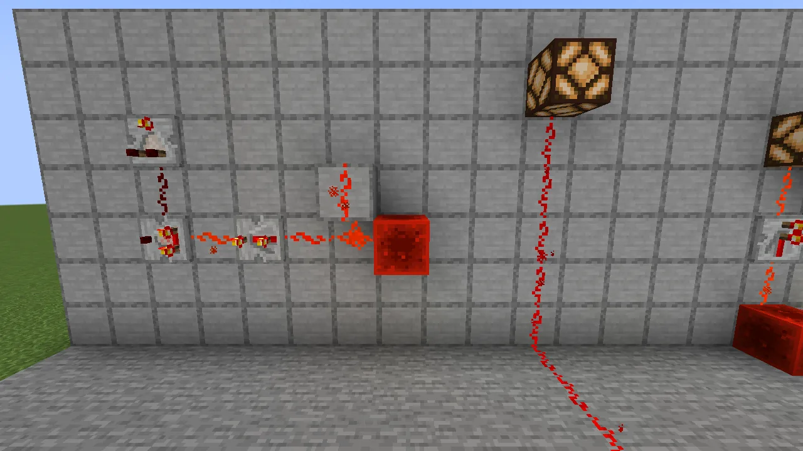
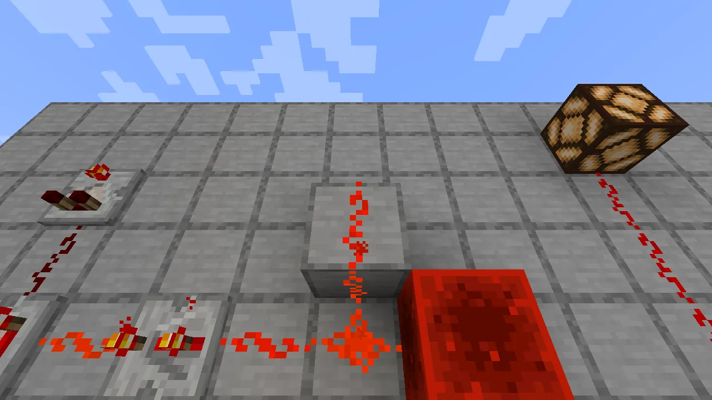
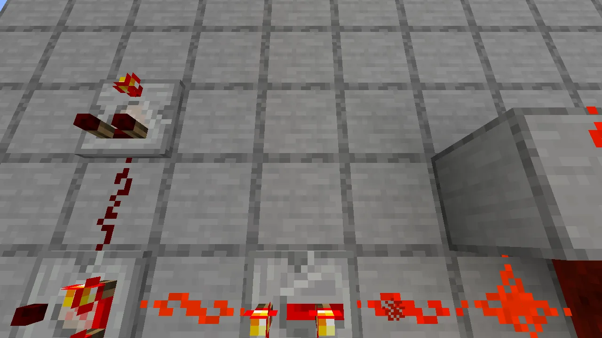
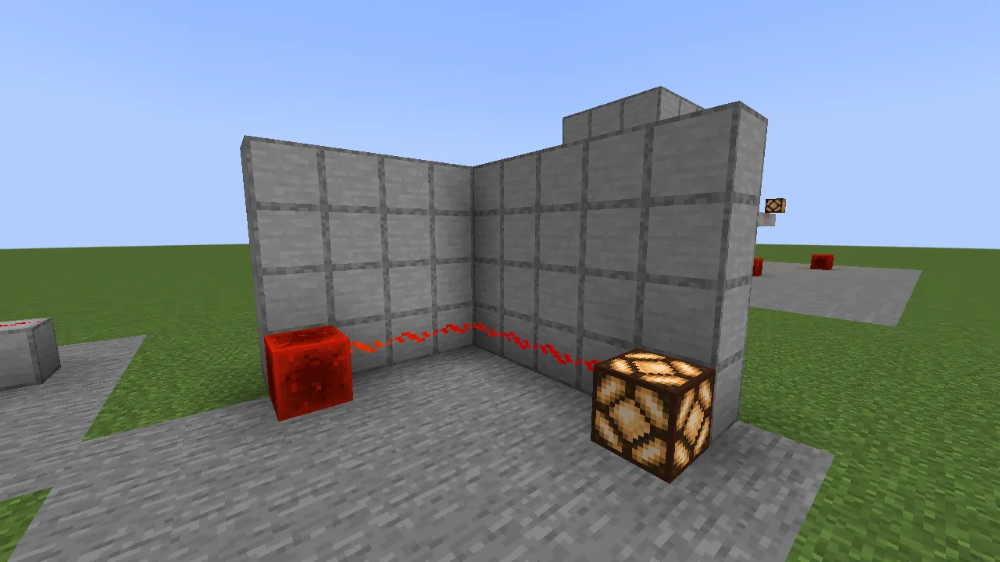
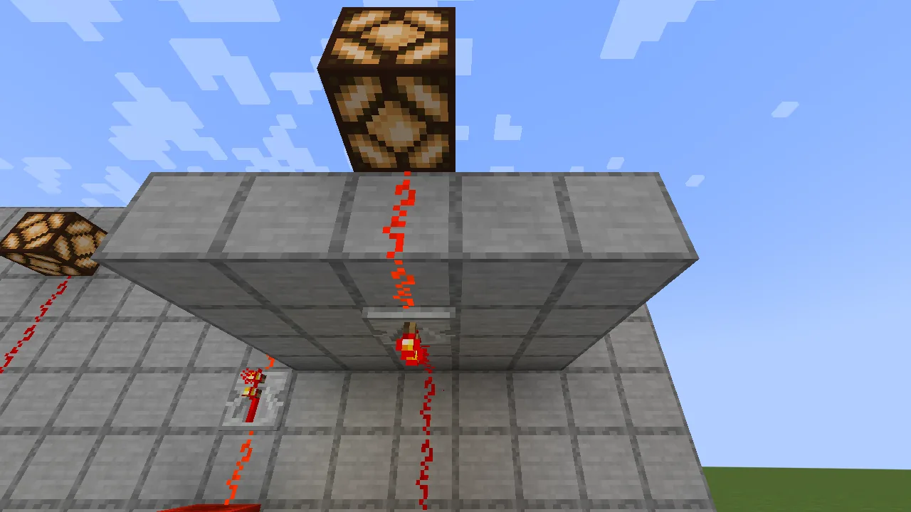
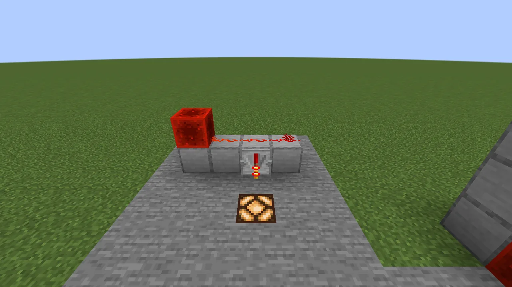

Redstone dust, repeaters and comparators **on walls and on the undersides of blocks**, behaving
exactly as they do on a floor. There are no new items: you place the ordinary ones.

## Placing

Hold redstone dust, a repeater or a comparator and:

- **click a wall face:** it goes on the wall;
- **click the underside of a block:** it hangs from the ceiling;
- **click a floor:** it's ordinary floor redstone, as always.

It works like a torch: the face you click decides, and in a corner, the way you're looking does.
Clicking a wall just above the floor gives the wall form, so click the floor itself for the floor
form. Dust won't go on a face that isn't solid (glass, a fence), just as on a floor. Broken, they
drop the ordinary item, and pick-block gives the ordinary item.

## How it behaves

**A wall is a floor stood up**, and a ceiling is a floor turned over. Everything floor redstone does,
wall and ceiling redstone does the same way:

- Dust draws lines and corners toward what it connects to, a click turns a lone piece between a cross
  and a dot, and it loses one power level per block.
- It powers the block behind it strongly and what it points at weakly.
- A **repeater** on a wall takes its input from behind it along the wall and outputs ahead. Click it
  to change the delay. A diode pointing into its side locks it.
- A **comparator** on a wall reads a container behind it along the wall (or two blocks behind,
  through a solid block, or an item frame), and clicks between comparing and subtracting.

## Corners and edges

A run turns **any corner** between floor, wall and ceiling, and draws it. Over an edge (the top of a
wall onto the floor above it), the lines meet at the edge. Into a corner (a floor run up a wall, a
wall run onto the next wall or onto the ceiling), the piece in the corner climbs the block beside it,
just as floor dust climbs onto a block. Power crosses every corner one level down. Two pieces facing
each other across a gap don't connect, just as on a floor.

## The block it hangs on

A wall repeater or comparator also takes power from **the block it hangs on**: dust running along
the top of that block, dust pointing into it, or a torch under it. So a run along the top of a row
of blocks can drop into a repeater hanging just below the row's edge. A torch standing *on* the block
doesn't count, as a torch never powers the block it's attached to.

**The one thing it can't do:** a wall diode can't lock an ordinary *floor* repeater beside it. A wall
repeater locks any wall repeater, and a floor repeater locks a wall one.
